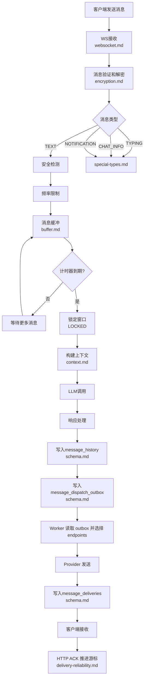

# 消息系统

消息系统负责处理客户端与服务端之间的所有消息通信，包括用户消息、AI响应、输入状态、系统通知等。

## 完整消息流

```mermaid
flowchart TB
    A[客户端发送消息] --> B[WS接收<br/>websocket.md]
    B --> C[消息验证和解密<br/>encryption.md]
    C --> D{消息类型}

    D -->|TEXT| E[安全检测]
    D -->|TYPING| F[special-types.md]
    D -->|CHAT_INFO| F
    D -->|NOTIFICATION| F

    E --> G[频率限制]
    G --> H[消息缓冲<br/>buffer.md]
    H --> I{计时器到期?}

    I -->|否| J[等待更多消息]
    J --> H

    I -->|是| K[锁定窗口<br/>LOCKED]
    K --> L[构建上下文<br/>context.md]
    L --> M[LLM调用]
    M --> N[响应处理]
    N --> O[写入message_history<br/>schema.md]
    O --> P[写入message_dispatch_outbox<br/>schema.md]
    P --> Q[Worker 读取 outbox 并选择 endpoints]
    Q --> R[Provider 发送]
    R --> S[写入message_deliveries<br/>schema.md]
    S --> T[客户端接收]
    T --> U[HTTP ACK 推进游标<br/>delivery-reliability.md]
```
